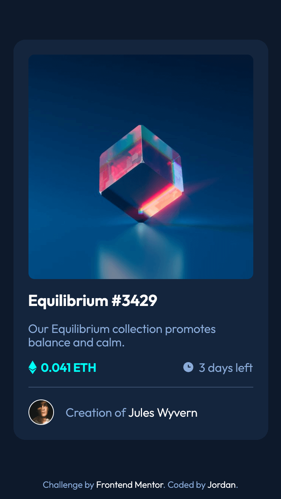

# Frontend Mentor - NFT preview card component solution

This is my solution to the [NFT preview card component challenge on Frontend Mentor](https://www.frontendmentor.io/challenges/nft-preview-card-component-SbdUL_w0U). Frontend Mentor offers web design challenges to help developers practice their front-end skills.

## Table of contents

- [Overview](#overview)
  - [The challenge](#the-challenge)
  - [Screenshot](#screenshot)
  - [Links](#links)
- [My process](#my-process)
  - [Built with](#built-with)
  - [What I learned](#what-i-learned)
  - [Continued development](#continued-development)
  - [Useful resources](#useful-resources)
- [Author](#author)
- [Acknowledgments](#acknowledgments)

## Overview

### The challenge

Users should be able to:

- View the optimal layout depending on their device's screen size
- See hover states for interactive elements

### Screenshot




### Links

- Solution URL: [solution URL here](https://www.frontendmentor.io/solutions/nft-preview-card-component-with-flexbox-BPOQdIhJ0I)
- Live Site URL: [live site link](https://jordanallybrown.github.io/nft-preview-card-component/)

## My process

### Built with

- Semantic HTML5 markup
- CSS custom properties
- Flexbox
- Mobile-first workflow

### What I learned

This project was my 4th Frontendmentor challenge! This project was another card layout, so I focused on organizing my planning and process approach to developing, e.g., deciding on CSS display choices, variable names, semantic HTML elements, etc., in advance. 

There were two interesting CSS issues I came across with solutions I'd like to highlight: 

To position the icons next to '*0.041 ETH*' and '*3 days left*', I used `li` tags in an `ul` list. But instead of modifying the list-style decoration (since there isn't a way to center this property), I used the `::before` pseudo-element on the `li` to place the images:

```css
li {
    position: relative;
    list-style-type: none;
}

li:first-child:before {
    content: url(../images/icon-ethereum.svg);
    position: absolute;
    left: 0;
    top: 0;
    width: 11px;
    height: 18px;
}
```

To add the view icon when hovering over the equillibrium `img`, I had to use a combination of modifying the `background` properties of the hyperlink and using the `::before` pseudo-element of the `img` to position and display the view icon on hover:
```css
.card__hero {
    border-radius: 0.5rem;
    height: 300px;
    position: relative;
    transition: 0.4s;
}

.card__hero img {
    width: 100%;
    height: auto;
    border-radius: inherit;
    z-index: -1;   
}

.card__hero:hover {
    background-color: var(--color-transparent-cyan);
    /* The view icon was transparent, so use pseudo before property instead */
    /* background-image: url(../images/icon-view.svg); */
    background-repeat: no-repeat;
    background-position: center;
}
.card__hero img:hover {
    opacity: 0.3;
}
.card__hero:hover::before {
    content: url(../images/icon-view.svg);
    position: absolute;
    /* center the view icon completely */
    top: 50%;
    left: 50%;
    transform: translate(-50%, -50%);
    width: 48px;
    height: 48px;
    /* Makes the view icon in front to stay white color rather than transparent */
    z-index: 1;
    /* Makes sure that even when user hovers over view icon, the card__hero hover effects are still in place */
    pointer-events: none;
}
```

### Continued development

For my next project, I would like to work more with mobile and responsive designs. 

### Useful resources

- [List style image position](https://stackoverflow.com/questions/1708833/adjust-list-style-image-position) - Useful stackoverflow thread on different ways to modify the list-style image.
- [CSS Overlay](https://dev.to/ellen_dev/two-ways-to-achieve-an-image-colour-overlay-with-css-eio) - Article that helps explain different ways to achieve an image overlay with CSS
- [Absolute Centering in CSS](https://medium.com/front-end-weekly/absolute-centering-in-css-ea3a9d0ad72e) - Helpful medium article on how to center elements using absolute positioning. 
- [CSS Transition on hover](https://www.w3schools.com/HOWTO/howto_css_transition_hover.asp) - W3School article on CSS transition


## Author

- Website - [jordanallybrown](https://github.com/jordanallybrown)
- Frontend Mentor - [@jordanallybrown](https://www.frontendmentor.io/profile/jordanallybrown)

## Acknowledgments

For the `sr-only` CSS class, I used [Tailwind's class specifications](https://tailwindcss.com/docs/screen-readers) to improve accessibility for screen readers and SEO. 
