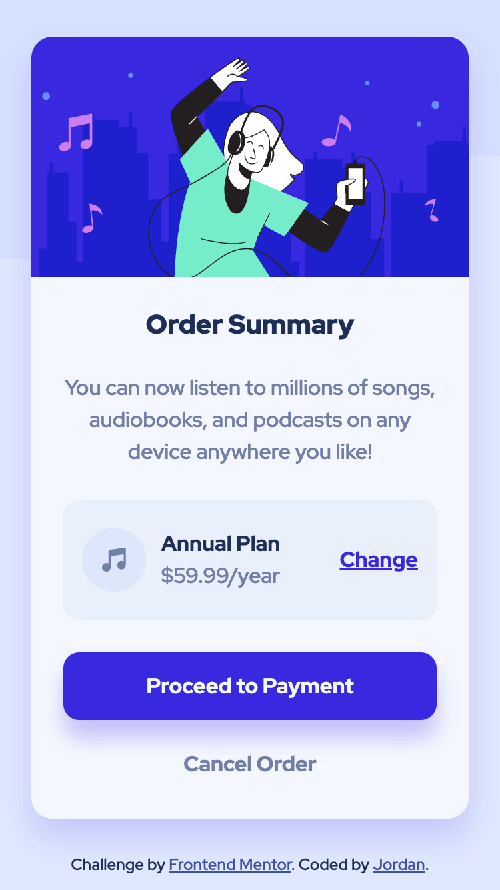
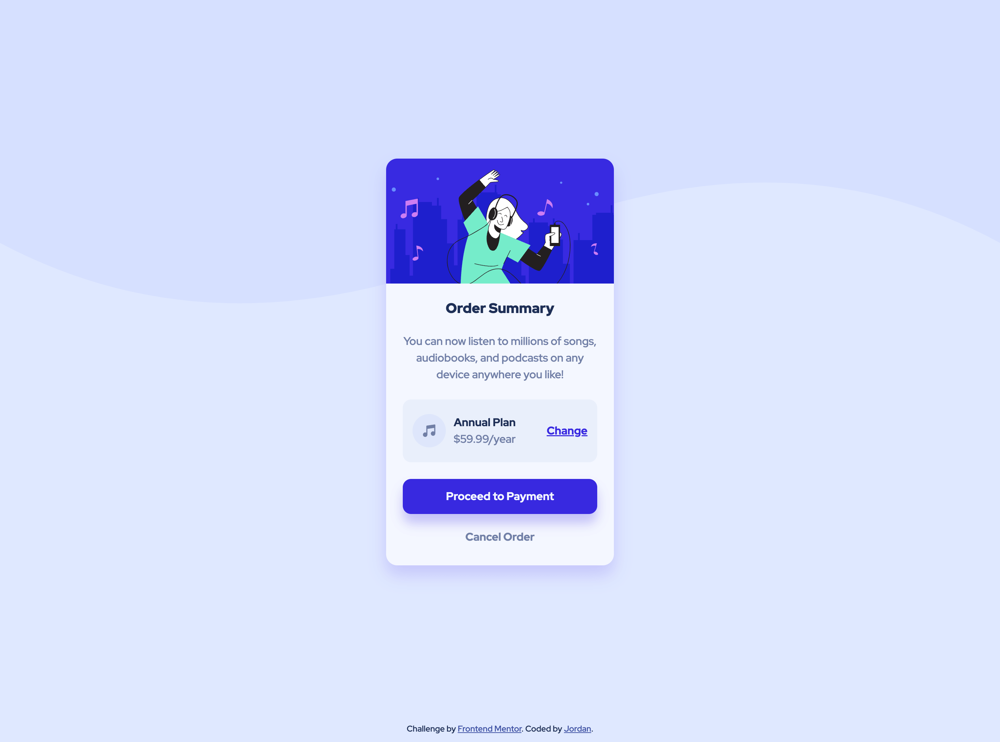

# Frontend Mentor - Order summary card solution

This my solution to the [Order summary card challenge on Frontend Mentor](https://www.frontendmentor.io/challenges/order-summary-component-QlPmajDUj). Frontend Mentor offers web design challenges to help developers practice their front-end skills.

## Table of contents

- [Overview](#overview)
  - [The challenge](#the-challenge)
  - [Screenshot](#screenshot)
  - [Links](#links)
- [My process](#my-process)
  - [Built with](#built-with)
  - [What I learned](#what-i-learned)
  - [Continued development](#continued-development)
  - [Useful resources](#useful-resources)
- [Author](#author)
- [Acknowledgments](#acknowledgments)

## Overview

### The challenge

Users should be able to:

- See hover states for interactive elements

### Screenshot

Mobile

Desktop

### Links

- Solution URL: [Link to solution url](https://www.frontendmentor.io/challenges/order-summary-component-QlPmajDUj/hub/order-summary-component-with-css-grid-7CIPRtMn0Y)
- Live Site URL: [Link to live site](https://jordanallybrown.github.io/frontendmentor/order-summary-card/)

## My process

### Built with

- Semantic HTML5 markup
- CSS custom properties
- Flexbox
- CSS Grid
- Mobile-first workflow

### What I learned

This project was my 3rd Frontend Mentor challenge! This project was a card layout, so I built upon the skills from the last challenge, plus new concepts. I used CSS Grid for the card layout and the Body, Element, and Modifier (BEM) naming convention for most of my CSS variables. I liked the BEM system; the naming approach helped my code readability and created reusable styles. 

I also faced a User Experience (UX) design decision (yay)! Within the card, there are 'Proceed to Payment' and 'Cancel Order' actions. I needed to decide whether to create them as buttons or hyperlinks -- a common UX problem. Because of the 'Proceed to Payment' appearance in the designs indicated this was a button. But I was unsure whether to make 'Cancel Order' a hyperlink or button. I found an [interesting article exploring this idea and the accessibility concerns](https://uxmovement.com/buttons/when-to-use-a-button-or-link/) surrounding it. In summary, a button is for elements that make changes to the front-end and back-end (e.g., submitting a form, making a payment), while a hyperlink is for helping users browse and navigate throughout the page. Since the 'Cancel Order' would not make any changes to the back-end, the element worked best as a hyperlink. 

### Continued development
For my next project, I would like to expand on using BEM and try the Object-Oriented CSS convention to see how it helps improve my CSS code readability. I also would like to continue to use CSS Grid and Flexbox in combination with one another. Lastly, I would like to start on challenges that include mobile vs. desktop screen design changes. 

### Useful resources

- [Semantic HTML5 Cheatsheet](https://learn-the-web.algonquindesign.ca/topics/html-semantics-cheat-sheet/) 
- [BEM Naming Convention](https://css-tricks.com/bem-101/) - Useful article on how to use the BEM naming in CSS
- [CSS Variables](https://codersblock.com/blog/what-can-you-put-in-a-css-variable/) - Nice article on what things you can assign to CSS variables
- [Button Click Animation](https://www.w3schools.com/howto/howto_css_animate_buttons.asp) - W3School article on button animation styles
- [CSS Grid Guide](https://css-tricks.com/snippets/css/complete-guide-grid/) - Great article on understanding CSS Grid

## Author

- Website - [jordanallybrown](https://github.com/jordanallybrown)
- Frontend Mentor - [@jordanallybrown](https://www.frontendmentor.io/profile/jordanallybrown)

## Acknowledgments

For the `sr-only` CSS class, I used [Tailwind's class specifications](https://tailwindcss.com/docs/screen-readers) to improve accessibility for screen readers and SEO. 
