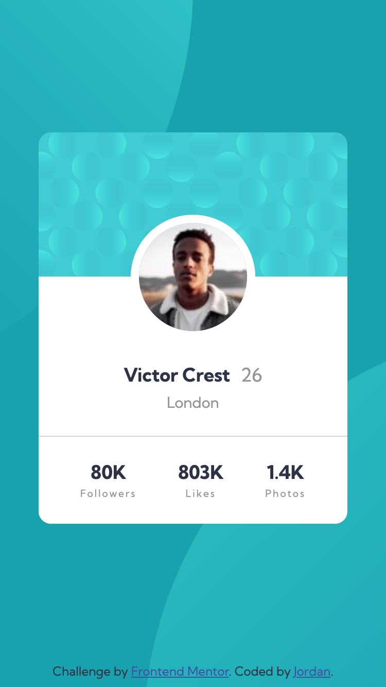
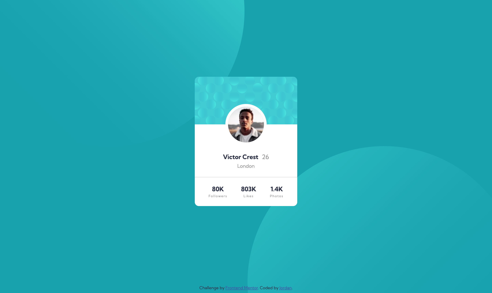

# Frontend Mentor - Profile card component solution

This is my solution to the [Profile card component challenge on Frontend Mentor](https://www.frontendmentor.io/challenges/profile-card-component-cfArpWshJ). Frontend Mentor offers web design challenges to help developers practice their front-end skills.

## Table of contents

- [Overview](#overview)
  - [The challenge](#the-challenge)
  - [Screenshot](#screenshot)
  - [Links](#links)
- [My process](#my-process)
  - [Built with](#built-with)
  - [What I learned](#what-i-learned)
  - [Continued development](#continued-development)
  - [Useful resources](#useful-resources)
- [Author](#author)


## Overview

### The challenge

- Build out the project to the designs provided

### Screenshot

Mobile screenshot:


Desktop screenshot:


### Links

- Solution URL: [Link to solution URL](https://www.frontendmentor.io/solutions/profile-card-component-challenge-using-css-flexbox-and-selectors-D2ZqwrEXTX)
- Live Site URL: [Link to live site](https://jordanallybrown.github.io/profile-card-component/)

## My process

### Built with

- Semantic HTML5 markup
- CSS custom properties
- Flexbox
- Mobile-first workflow


### What I learned

This project was my second Frontendmentor challenge! The project was another card layout, but I had fun using CSS selectors (rather than relying on classes) to target particular elements. Additionally, I learned new ways to manipulate and position the `background-image` property.

Here's a CSS snippet of what I used to position the card image: 
```css
article {
    background-image: url("../images/bg-pattern-card.svg");
    background-repeat: no-repeat;
    background-position: center top;
}
```

Lastly, here are some useful commands and ideas: 
- `Ctrl + C` to quit terminal 
- (`..`) path to getting out of immediate directory


### Continued development

Positioning the background SVG images was a bit tricky in this project. I used media queries and `rem` sizing to target the desktop and mobile view. However, I'd like circle back on this project after doing some more challenges. I believe there's a better way of positioning the images, so they are clipped and stick to the bottom as the page resizes. 

For future projects, I want to use more CSS variables for standard and reusable size values, e.g., font size, padding, etc. Additionally, I want to take a deeper dive into `normalize.css` and gain further understanding about the CSS box model.  


### Useful resources

- [Positioning Background images](https://www.w3schools.com/cssref/pr_background-position.asp) - Super useful W3School article on setting the background image.
- [Background-position Coordinates](https://developer.mozilla.org/en-US/docs/Web/CSS/background-position-x
) - A deep dive into background-position coordinates.
- [Media queries](https://www.w3schools.com/cssref/css3_pr_mediaquery.asp) - Quick W3School article on setting media queries. 
- [CSS selectors list](https://www.w3schools.com/cssref/css_selectors.asp) - List of CSS selector patterns and demonstrations on how they work.

## Author

- Website - [jordanallybrown](https://github.com/jordanallybrown)
- Frontend Mentor - [@jordanallybrown](https://www.frontendmentor.io/profile/jordanallybrown)


