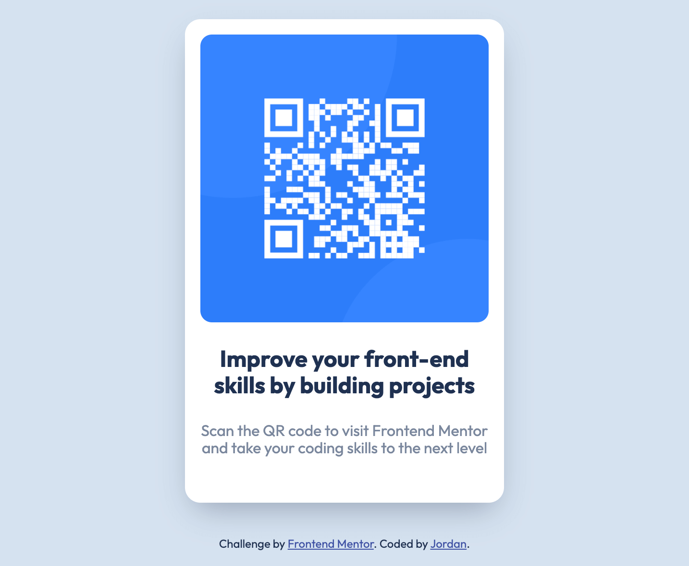

# Frontend Mentor - QR code component solution

This is my solution to the [QR code component challenge on Frontend Mentor](https://www.frontendmentor.io/challenges/qr-code-component-iux_sIO_H). Frontend Mentor offers web design challenges to help developers practice their front-end skills. 

## Table of contents

- [Overview](#overview)
  - [Screenshot](#screenshot)
  - [Links](#links)
- [My process](#my-process)
  - [Built with](#built-with)
  - [What I learned](#what-i-learned)
  - [Continued development](#continued-development)
  - [Useful resources](#useful-resources)
- [Author](#author)

## Overview

### Screenshot



### Links

- Solution URL: [Link to solution URL](https://www.frontendmentor.io/solutions/qr-code-component-using-flexbox-a2C7_flAYK)
- Live Site URL: [Link to live site](https://jordanallybrown.github.io/frontendmentor/qr-code-component/)

## My process

### Built with

- Semantic HTML5 markup
- CSS custom properties
- Flexbox
- Mobile-first workflow

### What I learned

This project was my first Frontendmentor challenge! Although a small design project, building this challenge helped me refresh my knowledge of semantic HTML tags and Flexbox layout concepts in CSS. 

During development, I learned the importance of using the CSS unit rem (root em) in font-sizing to improve accessibility. I also optimized my images to improve website performance. 

And lastly, for reference in my projects going forward, here are some helpful CSS code snippets: 

Make the `body` tag cover the fullscreen (**note** the `box-sizing` removes the side scrollbar):
```css
body {
    min-height: 100vh;
    box-sizing: border-box;
}
```
Make an image responsive:
```css
img {
    width: 100%;
    height: auto;
}
```
Create a sticky footer using flexbox:
```css
body {
    min-height: 100vh;
    box-sizing: border-box;
    display: flex;
    flex-direction: column;
}

footer {
  margin-top: auto;
}
```

### Continued development

In future projects, I want to continue to explore and research how I can make my websites more accessible. 

### Useful resources

- [Tiny PNG](https://tinypng.com/) - This is an awesome website that helped me optimize my png screenshots.
- [A Complete Guide to Flexbox](https://css-tricks.com/snippets/css/a-guide-to-flexbox/) - My goto article for references CSS Flexbox.
- [Responsive web images](https://www.w3schools.com/howto/howto_css_image_responsive.asp) - A helpful article on how to make images responsive by W3Schools.
- [Normalize.css](https://github.com/necolas/normalize.css/blob/master/normalize.css) - The repository for normalize.css. 
- [Sticky footers with Flexbox](https://wetainment.com/articles/sticky-html-footer/) - A detailed article with tips on how to make sticky footers using flexbox. 

## Author

- Website - [jordanallybrown](https://github.com/jordanallybrown)
- Frontend Mentor - [@jordanallybrown](https://www.frontendmentor.io/profile/jordanallybrown)

